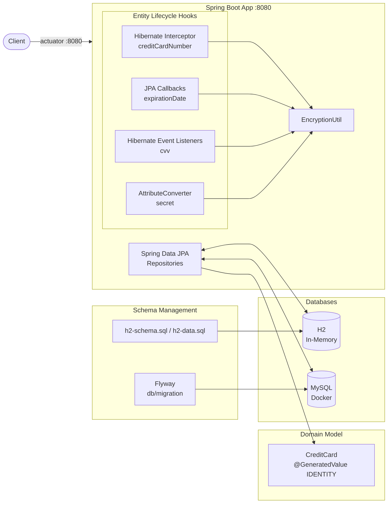
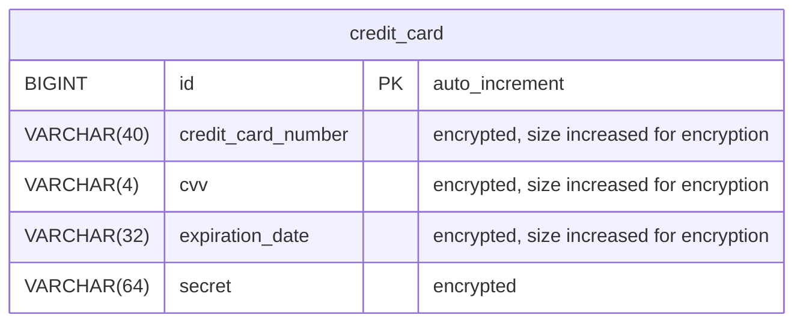

# Spring Data JPA Credit Card

A Spring Boot 4 (Java 25) demo project showing how to hook into the JPA entity lifecycle: a
`CreditCard` entity is managed through Spring Data JPA while Entity Listeners, JPA Callbacks,
Hibernate Interceptors and an `AttributeConverter` handle auditing and encryption of sensitive
card data. Schema management runs with Flyway on MySQL and Spring SQL init on in-memory H2
(MySQL-compat mode); the app ships with Actuator/observability endpoints and deploys as a Docker
image packaged into a Helm chart.

## Architecture Overview



## Database Schema



## JPA Interceptors, Listener, Callbacks

The `CreditCard` entity demonstrates how to hook into the JPA/Hibernate entity lifecycle. All hooks
serve one purpose here: encrypting sensitive card data before it is written and decrypting it after it
is read — each field via a different mechanism, all backed by the central `EncryptionUtil`.

|       Field        |         Mechanism         |                        Implementation                        |
|--------------------|---------------------------|--------------------------------------------------------------|
| `creditCardNumber` | Hibernate Interceptor     | `EncryptionInterceptor` (`Interceptor` interface)            |
| `expirationDate`   | JPA Callbacks             | `CreditCardJPACallback` via `@EntityListeners`               |
| `cvv`              | Hibernate Event Listeners | `PreInsertListener`, `PreUpdateListener`, `PostLoadListener` |
| `secret`           | JPA AttributeConverter    | `CreditCardConverter` via `@Convert`                         |

- **JPA Entity Listeners + Callbacks**: `CreditCardJPACallback` is registered on the entity with
  `@EntityListeners(CreditCardJPACallback.class)`; `@PrePersist`/`@PreUpdate` encrypt `expirationDate`
  before the write, `@PostPersist`/`@PostLoad`/`@PostUpdate` decrypt it afterwards.
- **Hibernate Interceptor**: `EncryptionInterceptor` implements the `Interceptor` interface and
  encrypts/decrypts `creditCardNumber` on every load/persist, regardless of how the session operation
  is triggered. It is registered as session factory interceptor via a `HibernatePropertiesCustomizer`
  (`InterceptorRegistration`).
- **Hibernate Event Listeners**: `PreInsertListener`/`PreUpdateListener` (encrypt) and
  `PostLoadListener` (decrypt) handle `cvv`. They are plain Spring beans appended to Hibernate's
  `EventListenerRegistry` (`PRE_INSERT`, `PRE_UPDATE`, `POST_LOAD`) by the `ListenerRegistration`
  `BeanPostProcessor`.
- **JPA AttributeConverter**: `CreditCardConverter` implements `AttributeConverter<String, String>` and
  is applied to the `secret` field via `@Convert`, so encryption happens transparently on every
  read/write.

For more information please refer to the following documents in the `doc` folder:

- [ListenersAndInterceptors](doc/ListenersAndInterceptors.pdf): This document provides a comprehensive overview of JPA Entity Listeners and Hibernate Interceptors.
- [OverviewOfDBTransactions](doc/OverviewOfDBTransactions.pdf): This document provides a comprehensive overview of database transactions.
- [SpringDataJPATransactions](doc/SpringDataJPATransactions.pdf): This document describes transaction handling with Spring Data JPA.

## Flyway

Flyway is enabled by default in the MySQL profile (`application-mysql.yaml`); the migrations live in
`src/main/resources/db/migration`. This profile starts MySQL on port 3306 using the Docker Compose
file `compose-mysql.yaml`.

In the H2 profile Flyway is disabled; H2 is initialized via `h2-schema.sql`/`h2-data.sql`
(Spring SQL init).

## Docker

The Docker Compose file mounts the startup script `src/scripts/init-mysql.sql` into the MySQL init
directory (`/docker-entrypoint-initdb.d`). The script creates the database `paymentdb` and the users
`paymentadmin` (Flyway user) and `paymentuser` (application user).

## Kubernetes

### Deployment with Helm

Be aware that we are using a different namespace here (not default).

The preconfigured IntelliJ run configurations `deploy-k8s`, `test-k8s` and `uninstall-k8s` (`.run/`)
automate the install, test and uninstall steps below.

Go to the directory where the tgz file has been created after 'mvn install'

```powershell
cd target/helm/repo
```

unpack

```powershell
$file = Get-ChildItem -Filter sdjpa-credit-card-chart-*.tgz | Select-Object -First 1
tar -xvf $file.Name
```

install

```powershell
$APPLICATION_NAME = Get-ChildItem -Directory | Where-Object { $_.LastWriteTime -ge $file.LastWriteTime } | Select-Object -ExpandProperty Name
helm upgrade --install $APPLICATION_NAME ./$APPLICATION_NAME --namespace sdjpa-credit-card --create-namespace --wait --timeout 8m --debug --render-subchart-notes
```

show logs

```powershell
kubectl get pods -n sdjpa-credit-card
```

replace $POD with pods from the command above

```powershell
kubectl logs $POD -n sdjpa-credit-card --all-containers
```

Show Endpoints

```powershell
kubectl get endpoints -n sdjpa-credit-card
```

test

```powershell
helm test $APPLICATION_NAME --namespace sdjpa-credit-card --logs
```

status

```powershell
helm status $APPLICATION_NAME --namespace sdjpa-credit-card
```

uninstall

```powershell
helm uninstall $APPLICATION_NAME  --namespace sdjpa-credit-card
```

delete all

```powershell
kubectl delete all --all -n sdjpa-credit-card
```

create busybox sidecar

```powershell
kubectl run busybox-test --rm -it --image=busybox:1.36 --namespace=sdjpa-credit-card --command -- sh
```

You can use the actuator rest call to verify via port 30080

## Running the Application

1. Choose between h2 (Spring SQL init) or mysql (Flyway) for database schema management. (you can use one of the preconfigured IntelliJ run configurations `Spring6Application h2` / `Spring6Application mysql`)
2. Start the application with the appropriate profile and properties.
3. The application will use Docker Compose to start MySQL and apply the database schema changes.

## Sandbox (local dev environment)

The sandbox is provisioned by the opencode-sandbox-kit and runs as a Docker container. It mounts this
repo, starts the agent, and connects the IntelliJ MCP server. The app runs on port `8080`; `compose-mysql.yaml`
provides MySQL.

Allow the kit source (GitHub without cloning):

```powershell
sbx settings set kit.allowedSources --% "[\"docker.io/\",\"github.com/dboeckli/\"]"
```

Start a new sandbox:

```powershell
sbx run opencode `
    --kit "git+https://github.com/dboeckli/opencode-sandbox-kit.git#dir=opencode-agent" `
    --template docker.io/domboeckli/sbx-opencode-tooling:latest `
    --skills=off `
    --static-mcp idea `
    . `
    "C:\development\maven-repo:ro"
```

Start the sandbox with Kubernetes support:

```powershell
sbx run opencode `
    --kit "git+https://github.com/dboeckli/opencode-sandbox-kit.git#dir=opencode-agent" `
    --template docker.io/domboeckli/sbx-opencode-tooling:latest `
    --skills=off `
    --static-mcp idea `
    . `
    "C:\development\maven-repo:ro" `
    "$env:USERPROFILE\.kube:ro"
```

Claude Code (Home) and Mammouth Code variants:

```powershell
sbx run claude `
    --kit "git+https://github.com/dboeckli/opencode-sandbox-kit.git#dir=opencode-agent" `
    --template docker.io/domboeckli/sbx-claude-tooling:latest `
    --skills=off `
    --static-mcp idea `
    . `
    "C:\development\maven-repo:ro"
```

```powershell
sbx run "git+https://github.com/dboeckli/opencode-sandbox-kit.git#dir=mammouth-agent" `
    --kit-arg imageTag=latest `
    --skills=off `
    --static-mcp idea `
    . `
    "C:\development\maven-repo:ro"
```

### Start the app

Start MySQL (H2 needs no Docker):

```shell
docker compose -f compose-mysql.yaml up
```

Then run one of the IntelliJ run configurations (`.run/Spring6Application h2.run.xml` or the MySQL
one) or start via `./mvnw spring-boot:run -Dspring-boot.run.profiles=h2`.

### Sandbox build quirk

The sandbox mounts the repo via filesystem passthrough, which blocks symlinks — Spotless's `npm install`
(prettier) would fail with `EPERM` unless npm skips bin links. The kit sets `npm_config_bin_links=false`
globally, so no manual export is needed.
